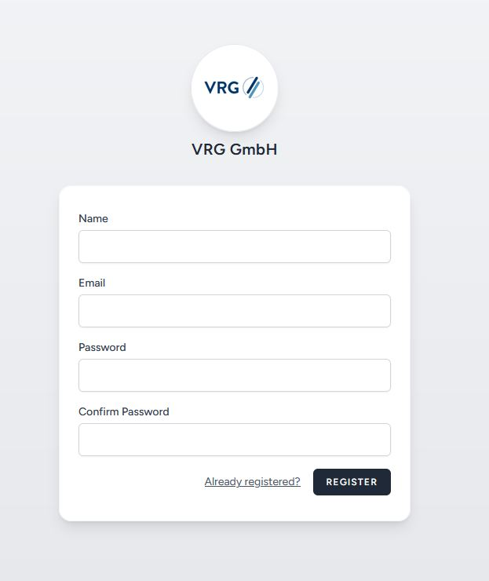
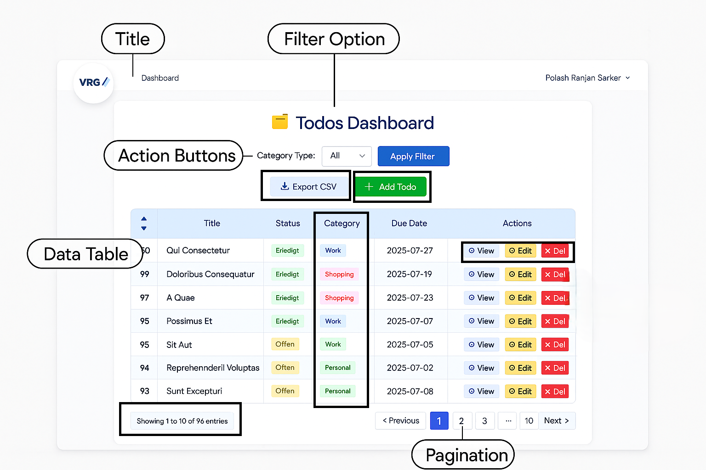
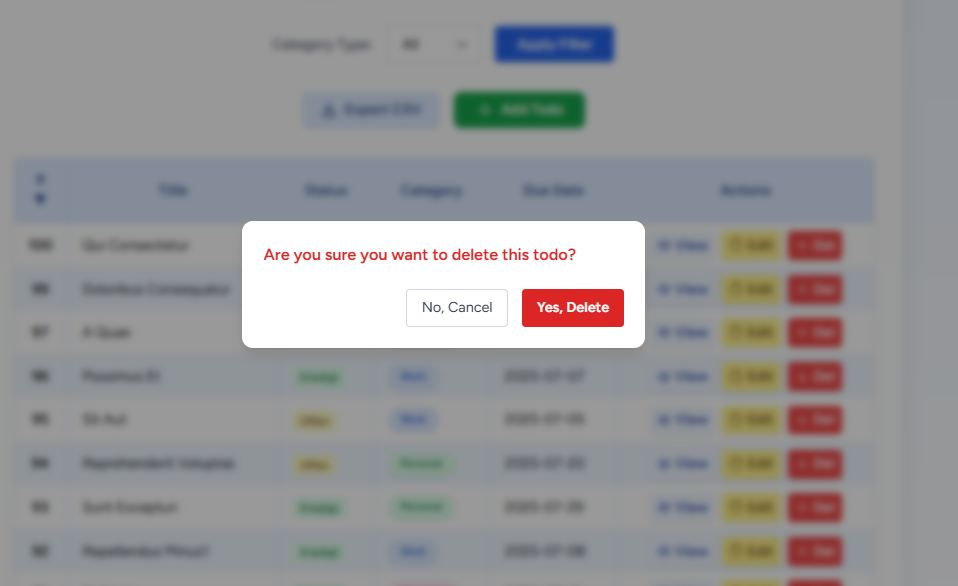

# 📝 Laravel + Vue 3 + Vite + Inertia CRUD Todo App

A modern, full-stack Laravel 12 + Vue 3 (Vite + Inertia.js) demo app to manage Todos, built with a clean service layer, category-aware tasks, flexible filtering, and beautiful UI.

---

## 🚀 Tech Stack

- **Backend:** Laravel 12 (PHP 8.2+), Service Layer, Repository/DAO, DTOs, Abstract Factory, Policy, Unit/Feature Tests
- **Frontend:** Vue 3, Vite, Inertia.js, Tailwind CSS
- **Auth:** Laravel Breeze (session-based)
- **Database:** PostgreSQL (recommended) or MySQL
- **Bonus:** Full test coverage, category-aware fields, filter & pagination, CSV export, screenshots
- **Code Quality:** Clean code practices, single-responsibility classes, and thorough documentation throughout the codebase

---

## 📸 Screenshots

### Register Page


### Login Page


### After Login Dashboard


### Todos Main


### Add Modal


### View Modal


### Edit Modal


### Delete Modal


### Filter


---

## ⚙️ Setup Instructions

### 1. Clone & Install

```bash
git clone https://github.com/polashsust/design-patterns-todo.git
cd design-patterns-todo

composer install
npm install
cp .env.example .env
php artisan key:generate
```

### 2. Database Setup

This project supports both PostgreSQL and MySQL. Create your database and update `.env`

**For PostgreSQL (Recommended)**

```
DB_CONNECTION=pgsql
DB_HOST=127.0.0.1
DB_PORT=5432
DB_DATABASE=todo_app
DB_USERNAME=postgres
DB_PASSWORD=# (your password)
```

**For MySQL**

```
DB_CONNECTION=mysql
DB_HOST=127.0.0.1
DB_PORT=3306
DB_DATABASE=todo_app
DB_USERNAME=root
DB_PASSWORD= # (your password)
```

**👉 Change only the values according to your local environment and database choice.**

**👉 All migrations and Eloquent models are compatible with both.**

---

### 3. Migrate & Seed

```bash
php artisan migrate
php artisan db:seed
```

### 4. Serve

```bash
php artisan serve
npm run dev
```
App is live at [http://localhost:8000/login](http://localhost:8000/login)

---

## 🗂️ Project Structure

```
app/
  Factories/             # AbstractFactory for category-aware todos
    ├── TodoCategoryAbstractFactory.php
    ├── TodoFactoryInterface.php
    ├── WorkTaskFactory.php
    ├── PersonalTaskFactory.php
    ├── ShoppingTaskFactory.php
  Http/
    Controllers/
    Requests/
    Resources/
    Middleware/
  Models/                # Eloquent models (Todo, User)
  Policies/              # Authorization policies
  Repositories/          # Repository interfaces & Eloquent implementations
  Services/              # Business logic, e.g. TodoService.php
  DTOs/                  # Data Transfer Objects (TodoDTO)
database/
  factories/             # Model factories for tests/seeding
  seeders/
resources/
  js/
    Pages/               # Vue pages (Todos/Index.vue, etc.)
    Components/          # Vue components (TodoTable, TodoForm, etc.)
    Assets/              # Static assets (logo, images)
public/
  screenshots/           
tests/
  Feature/               # Feature/HTTP tests
  Unit/                  # Unit tests
```

---

## 🧩 Design Patterns Used

**Repository Pattern:**  
Data access (`app/Repositories/`) abstracted behind interfaces.

**Service Layer:**  
Application logic in `app/Services/` (e.g., `TodoService`).

**DTOs (Data Transfer Objects):**  
Use of `app/DTOs/TodoDTO.php` for clear, type-safe data.

**Factory Pattern:**  
`database/factories/` for test and seed data.

**Abstract Factory Pattern:**  
Custom category-specific task creation in `app/Factories/`

- `TodoCategoryAbstractFactory.php`
- `WorkTaskFactory.php`
- `PersonalTaskFactory.php`
- `ShoppingTaskFactory.php`
- `TodoFactoryInterface.php`

**Policy Pattern:**
Task access control (app/Policies/TodoPolicy.php).

**Dependency Injection:**
Services, Repositories, and Factories are injected via constructors for loose coupling and testability:
  public function __construct(TodoRepositoryInterface $repo)
  {
      $this->repo = $repo;
  }

**This promotes clean architecture, easier unit testing, and better maintenance.**

---

## ✨ How to Use

- Register a new user or log in.
- Add/VieW/Edit/Delete Todos
- **Category fields:** Custom fields appear depending on chosen category (Work: priority, Personal: mood, Shopping: Estimated costs).
- **Filtering & Sorting:** Filter by category, sort by ID, paginate through todos.
- **CSV Export:** Download filtered/visible tasks.
- **Category highlighting:** Each category visually distinct.
- **Access control:** Users can only create/view/edit/delete their own todos.
- Bonus: Responsive, modern UI, and mobile support.

---

## 🚀 Redis Caching (Planned Feature)

Redis-based caching for improved performance and scalability is not yet implemented.  
This feature is planned for a future release to enable faster task retrieval and support for advanced caching strategies.

---

## 🧪 Testing

```bash
php artisan test
```
Includes unit tests for services & feature tests for CRUD flows.

---

## 🏭 Extending Category Types

1. **Create a new factory** in `app/Factories/`  
   _e.g._ `TravelTaskFactory.php`
2. **Implement** `TodoFactoryInterface` in your new factory.
3. **Register** it in `TodoCategoryAbstractFactory.php`.
4. **Update** the frontend form in `TodoForm.vue` to show additional inputs for your new category.

---

## 🖼️ UI/UX Highlights

- Clean, responsive dashboard
- All major CRUD in modals
- Colored categories, status badges
- Full pagination, CSV export, and entry count display

---

## 🔒 Security

- **Auth:** All task routes protected by auth and verified middleware.
- **Policy:** Per-user access enforced via Laravel Policy (TodoPolicy).
- **Passwords:** Securely hashed via bcrypt.
- **Access control:** Users can only create/view/edit/delete their own todos.

---

## 📄 License

[MIT](LICENSE)  
Feel free to use, modify, and contribute!

---